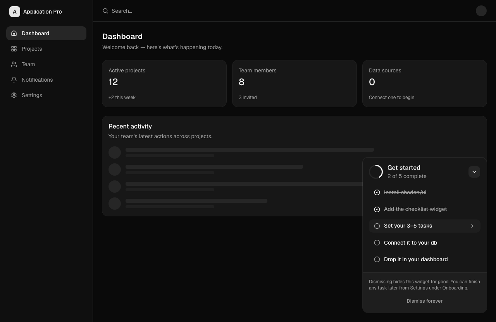

# Checklist Widget

A persistent onboarding checklist for the corner of your app — the kind Stripe,
Linear, and Notion use to get new users to their "aha" moment fast. Built with
[shadcn/ui](https://ui.shadcn.com).

- A progress ring + "X of N complete" header
- A clear **next step** highlight
- Collapse to a compact pill, or dismiss for good (with a confirm)
- Read-only by default (driven by your app/DB state); opt-in click-to-complete

It's a single component file. Copy it in, install the primitives it uses, set
your tasks, and wire it to your database.



## Installation

1. Make sure your project has shadcn/ui set up:

   ```bash
   npx shadcn@latest init
   ```

2. Add the primitives this component composes:

   ```bash
   npx shadcn@latest add card button item collapsible alert-dialog
   ```

3. Copy [`components/checklist-widget.tsx`](components/checklist-widget.tsx) into
   your project.

## Usage

Drop it anywhere — it's designed to live fixed in the bottom corner of your app
shell:

```tsx
import { ChecklistWidget } from "@/components/checklist-widget"

export default function DashboardShell({ children }) {
  return (
    <div className="relative min-h-dvh">
      {children}
      <div className="fixed bottom-6 right-6 z-50">
        <ChecklistWidget />
      </div>
    </div>
  )
}
```

### Props

| Prop        | Type      | Default | Description                                                              |
| ----------- | --------- | ------- | ------------------------------------------------------------------------ |
| `editable`  | `boolean` | `false` | When `true`, the current "next" step is clickable to complete (one-way). |
| `className` | `string`  | —       | Extra classes for the outer card (width, positioning overrides, etc.).   |

By default the widget is **read-only** — it reflects whatever onboarding state
you load. A completed step can never be un-completed from the UI.

## Set your tasks

Edit the `INITIAL_TASKS` array at the top of the file. Keep it to **3–5 specific,
high-signal steps** that lead to first value:

```ts
const INITIAL_TASKS: Task[] = [
  { id: "workspace", label: "Create your workspace", done: true },
  { id: "teammate", label: "Invite your first teammate", done: true },
  { id: "data-source", label: "Connect a data source", done: false },
  { id: "notifications", label: "Set up notifications", done: false },
  { id: "project", label: "Launch your first project", done: false },
]
```

The **next step** is derived automatically — it's the first task that isn't
`done`.

## Persist the state

Onboarding state is per-user and must survive refreshes and sessions. The file
ships with two clearly-marked stubs — replace them with your DB/API calls:

```ts
function loadOnboardingState(): Task[] {
  // TODO: fetch the signed-in user's saved task state from your DB/API.
  return INITIAL_TASKS
}

function saveOnboardingState(tasks: Task[], dismissed: boolean): void {
  // TODO: persist task completion + the dismissed flag against the user record.
}
```

The widget removes itself from the DOM once **all tasks are complete** (not just
when dismissed), so gate it on a per-user `onboardingComplete` flag too.

## Customization

- **Completed-check color** — the done check uses `text-accent-foreground`
  (monochrome, theme-aware). For a green "success" look, swap it for
  `text-emerald-500`, or add a `--success` token to your theme.
- **Next-step indicator** — a chevron by default; swap in a `Badge` if you
  prefer a "Next" / "Recommended" pill.
- **Width** — defaults to `w-80`; override via `className`.

## License

MIT — use it, ship it, make it yours.
